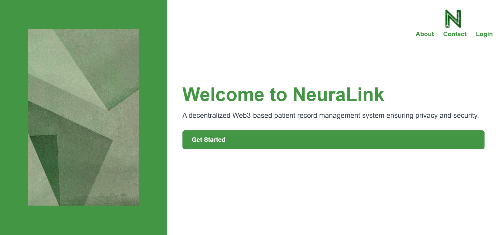
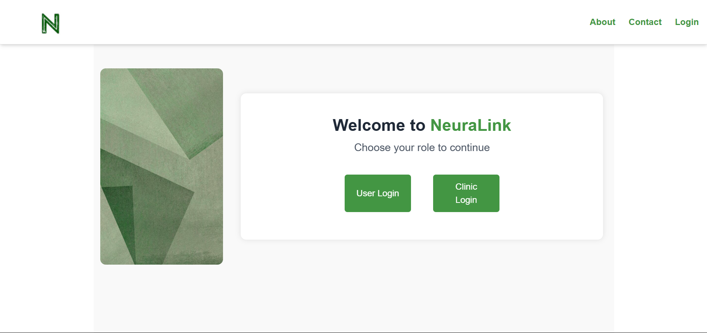
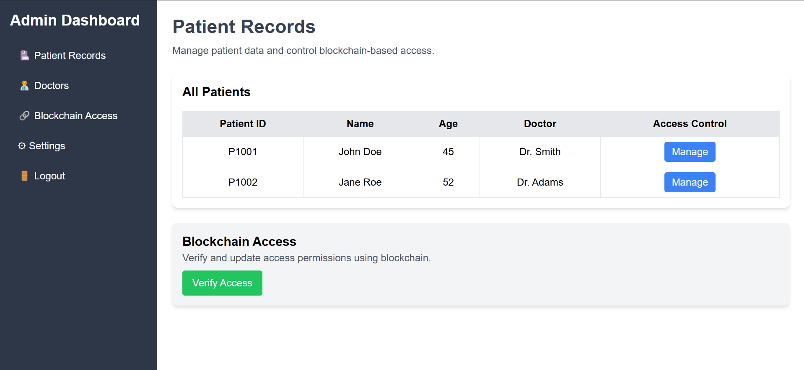
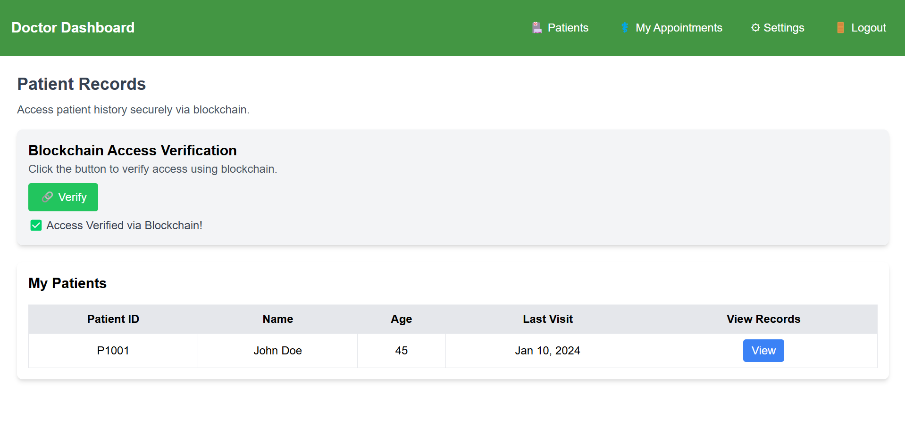

# NeuraLink: Decentralized Web3-Based Patient Record Management System 🌐🔐


---

## 📊 Overview
NeuraLink is a **Web3-based decentralized patient record management system** that leverages blockchain technology to provide secure, transparent, and tamper-proof access to patient records. Designed for clinics and individual users, NeuraLink ensures that sensitive medical data remains safe, while access is easily managed through a decentralized platform.

---

## 🛠️ Technologies Used

- **HTML5** 🔖
- **CSS3** 🖌️ - with Tailwind CSS for styling
- **JavaScript** 🔬 - for interactivity and DOM manipulation
- **AOS / Animate on Scroll** 🌟 - for smooth animations
- **Blockchain Technology** 🔐 - Planned for future integration with smart contracts

---

## 🚀 Unique Selling Points - USP

1. **🔐 Decentralized Security**: Powered by blockchain, ensuring data is tamper-proof and transparent.
2. **🌍 Universal Accessibility**: Access your health records securely from anywhere in the world.
3. **🌟 Seamless User Interface**: Clean, responsive, and animated UI for both clinics and users.
4. **🏛️ Role-Based Access Control**: Clinics and users have distinct dashboards with specific functionalities.
5. **📅 Patient History Management**: Track, update, and manage patient records with ease.

---

## 🔹 Screenshots

### 🔑 Login Page


### 🔑 Login Page


### 📅 Clinic Dashboard


### 📆 User Dashboard


---

## 💡 Upcoming Features

1. **🔧 Smart Contract Integration**: Integrating Ethereum smart contracts for secure, decentralized data management.
2. **📁 Backend Development**: Building a robust backend with Node.js and Express to handle API requests and database management.
3. **💰 Token-Based Access Control**: Implementing token-based systems for more granular data sharing permissions.
4. **🚀 Performance Optimization**: Further enhancements in load times, responsiveness, and user experience.

---

## 📖 How to Run Locally

1. **Clone the Repository**:
```bash
git clone https://github.com/Kaakay/NeuraLink.git
```
2. **Navigate to the Project Folder**:
```bash
cd NeuraLink
```
3. **Open in Browser**:
Just open the `index.html` file in your preferred browser.

---

## 📄 Contributing

1. Fork the repository 👉
2. Create your feature branch (`git checkout -b feature/AmazingFeature`) 🌟
3. Commit your changes (`git commit -m 'Add some AmazingFeature'`) 🖋️
4. Push to the branch (`git push origin feature/AmazingFeature`) 🚀
5. Open a Pull Request 🔗

---

## 🙏 Acknowledgements

- Thanks to the **Open Source Community** for providing inspiration and guidance.
- Special thanks to **Tailwind CSS** and **AOS** for enabling sleek and smooth UI/UX.

---

## 🌟 License

This project is licensed under the MIT License - see the [LICENSE.md](LICENSE.md) file for details.

---

### 📈 Stay Connected
For updates, keep checking:
**NeuraLink**: [@Kaakay (GitHub)](https://twitter.com/NeuraLinkHealth)

---

*Transforming healthcare, one block at a time.* 🚀🔐

